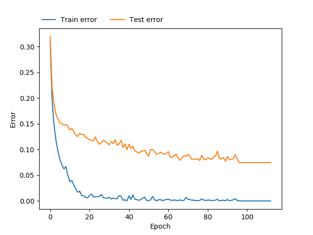

# DL4All - AutoML with Tensorflow
A short and simple 3 layers Neural Network Tensorflow code to classification  
Just specify your train and test/validation sets and let the algorithm classify your data!  
**python neural_network.py** does it all.  

## Dependencies
python 3.6.8 
#### Packages
numpy 1.16.3  
pandas 0.24.2  
scikit-learn 0.21.1  
scipy 1.2.1  
tensorflow 1.13.1 (to CPU process)  
tensorflow-gpu 1.13.1 (to GPU process)  

## Architecture
It's a 3 hidden layers MLP.  
You just need to specify a .csv file with the data to training, test or validation in dataset folder.  
You can set up the training/test file in the variable *train_path* and *test_path* **neural_network.py**  
It's set to iterate up to 300 epochs with an early stopping logic to avoid divergence.  

## Hyperparameters
LAYER1 = Neurons number in the first hidden layer  
LAYER2 = Neurons number in the second hidden layer  
LAYER3 = Neurons number in the third hidden layer  
LR = learning rate  
BETA = beta parameter to regularization. 0 to ignore  
The Hyperparameter optimization search is performed by a Random Search algorithm with 3 trails of hyperparameter  
**You can change the number of trails in the main function**

## Feature Selection
The method ExtraTreesClassifier is automatically applied to reduce the data dimension.  
In the MNIST example, the data dimension is reduced of 784 features to 274.

## Results
The best result founded in the Random Search is saved in the folder **TF_model**.  
The test/validation classification is inside this folder (**classification.csv**)  
The Tensorflow model (session) is saved inside the **sess** folder.

## Learning plot
At the end of the execution, some metrics like error rate and accuracy will be presented.  
A learning plot will also be displayed with train and test error rate.  

